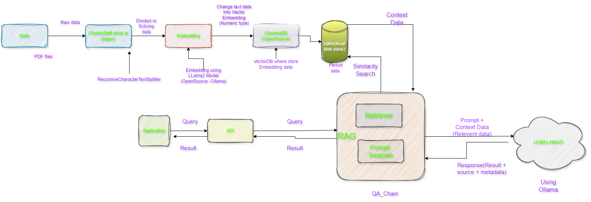

# __(O_O) Q&A Chatbot For PDF Document (O_O) __


This Respository contain a Flet(Flutter Application) that utilizes the LangChain and Ollama (openSource LLM Model as llama2) language model to create a conversational Q&A chatbot. The chatbot is designed to answer questions about the content of PDF document

## Table of  Contents
- [Q&A Chatbot for PDF  Document](#qa-chatbot-for-pdf-document)

    -[Table of Contents](#table-of-contents)

    -[Installation](#installation)
    
    -[Usage](#usage)

    -[Architecture](#architecture)

    -[License](#license)

    -[Contact](#contact)


## Installation

Before starting, make sure you have Python 3.8+ installed. To run the Q&A Chatbot, follow these steps:
1. Create Conda Env :
 ```
 conda create --name pdf_env python
 ```
1. Clone this repository:
```
git clone  https://github.com/GENRATECODE/pdf_chatbot.git
cd pdf_chatbot
```
2. Install the necessary Libraries:
```
pip install -r requirements.txt
```
3. Install Ollama
```
https://ollama.com/download
```

## Usage
 Dwonload LLM Model on Local Own System
```
ollama pull llama2
```
Run the application from your terminal with:
```
flet chatbot_ui.py
```
or 
```
python chatbot_ui.py
```
if Upload a pdf file and ask question about its content. The chatbot will generate answers based  on the context of the PDF.

docs/python1.pdf
copy and paste in ```docs``` folder
then run vectordb_embedding.py file 

```
python vectorDB_Embedding.py
```

## Architecture


#### Steps

I'd be glad to clarify the steps involved in creating a PDF chatbot using the provided code snippet:

1. Gathering and Loading the PDF File:

    * You'll need a PDF document stored in your project's docs directory.
    * The code utilizes langchain.Directory to locate all PDF files within that directory using the  `glob='./pdf'` pattern.
    * The `loader_cls=PyPDFLoader` argument specifies that the PyPDFLoader class from the LangChain library should be used for loading the PDF content.
2. Splitting the PDF into Chunks:

    * The `RecursiveCharacterTextSplitter` function takes the loaded PDF data and splits it into smaller, manageable segments.
    * This could involve dividing the document by pages, sections, or other logical groupings based on your specific needs.
3. Embedding Text Chunks into Numerical Representation:

    * The `OllamaEmbeddings(model='llama2')` function creates embeddings for each text chunk.
    * Embeddings are essentially numerical representations that capture the meaning and context of the text. This allows the retrieval and question answering models to efficiently work with the document's content.
    * The   llama2 model in this case suggests the use of a pre-trained language model (LLM) for generating these embeddings.
4. Saving Embeddings in a Vector Database:

    * The Chromadb(OpenSource VectorDatabase) function is used to create a vector database `(ChromaDB)` to store the generated embeddings. This enables efficient retrieval and searching of similar content later on.
    * `Chroma.from_documents` assembles the embeddings and corresponding text chunks into a document format for storage.
    * `persist_directory` specifies the directory where the database will be stored on your local disk.
    * `vectordb.persist()` permanently saves the database contents.
5. Creating Retrievers and the LLM Model:

    * A retriever object is created for each text chunk. Retrievers are responsible for finding relevant information from the corpus (in this case, the embeddings database) based on a given query.
    * The retriever.as_retriever() function likely prepares the retriever object for use in the question answering system.
    * LLM model Ollama(base_url='http:/localhost:11434',model="llama2") indicates the use of the Ollama LLM, probably running locally at http://localhost:11434. The model="llama2" part specifies the specific LLM variant employed.
6. Building the Retrieval-Augmented Generation (RAG) Chain:

    * The from langchain.chains import RetrievalQA function imports the RetrievalQA class, which is designed for building RAG chains.
    * RAG (Retrieval-Augmented Generation) combines retrieval from a knowledge base (here, the ChromaDB) with LLM generation to provide more informative and contextually relevant answers.
    * `qa_gen=RetrievalQA.from_chain_type(llm=llm_llama, chain_type="stuff", retriever=retriever, return_source_documents=True)` creates a qa_gen object that embodies the RAG chain.
    * `llm=llm_llama` assigns the previously defined LLM model to the chain.
    * `chain_type="stuff"` (the exact meaning depends on the LangChain library implementation) likely indicates the type of chain being created (possibly a generic retrieval and generation chain).
    * `retriever=retriever` specifies the retriever object to be used within the chain.
    * `return_source_documents=True` instructs the chain to return the source documents (text chunks) that were most relevant to the query in the response.
      
7. Interacting with the Chatbot (Querying):

    * Once the qa_gen object is constructed, you can interact with the chatbot by providing a question.
    * `qa_gen(question)['result']` extracts the answer generated by the RAG chain for the given question. This answer would likely combine information retrieved from the ChromaDB embeddings with text generation from the LLM model.
    * The `return_source_documents=True` setting in the qa_gen creation might also provide details about the relevant text chunks that contributed to the answer.

## License
This  project is licensed under the MIT License -


## Contact
For more information, feel free to reach out!

    -Abhay Swarnkar
    -Email: abhayswarnakar@gmail.com
    
-[Linkedin](https://www.linkedin.com/in/bhayswarnakarml/)

## Output


## Issuse During Installation Chromadb 

```
uilding wheel for hnswlib (pyproject.toml) ... error
  error: subprocess-exited-with-error
  
  × Building wheel for hnswlib (pyproject.toml) did not run successfully.
  │ exit code: 1
  ╰─> [21 lines of output]
      running bdist_wheel
      running build
      running build_ext
      creating tmp
      x86_64-linux-gnu-gcc -pthread -Wno-unused-result -Wsign-compare -DNDEBUG -g -fwrapv -O2 -Wall -g -fstack-protector-strong -Wformat -Werror=format-security -g -fwrapv -O2 -fPIC -I/home/namanc/codes/langchian_chromadb/venv/include -I/usr/include/python3.10 -c /tmp/tmp822lkln8.cpp -o tmp/tmp822lkln8.o -std=c++14
      x86_64-linux-gnu-gcc -pthread -Wno-unused-result -Wsign-compare -DNDEBUG -g -fwrapv -O2 -Wall -g -fstack-protector-strong -Wformat -Werror=format-security -g -fwrapv -O2 -fPIC -I/home/namanc/codes/langchian_chromadb/venv/include -I/usr/include/python3.10 -c /tmp/tmpw33wg22s.cpp -o tmp/tmpw33wg22s.o -fvisibility=hidden
      building 'hnswlib' extension
      creating build
      creating build/temp.linux-x86_64-cpython-310
      creating build/temp.linux-x86_64-cpython-310/python_bindings
      x86_64-linux-gnu-gcc -pthread -Wno-unused-result -Wsign-compare -DNDEBUG -g -fwrapv -O2 -Wall -g -fstack-protector-strong -Wformat -Werror=format-security -g -fwrapv -O2 -fPIC -I/tmp/pip-build-env-izlfj5h4/overlay/lib/python3.10/site-packages/pybind11/include -I/tmp/pip-build-env-izlfj5h4/overlay/lib/python3.10/site-packages/numpy/core/include -I./hnswlib/ -I/home/namanc/codes/langchian_chromadb/venv/include -I/usr/include/python3.10 -c ./python_bindings/bindings.cpp -o build/temp.linux-x86_64-cpython-310/./python_bindings/bindings.o -O3 -fopenmp -DVERSION_INFO=\"0.7.0\" -std=c++14 -fvisibility=hidden
      In file included from /tmp/pip-build-env-izlfj5h4/overlay/lib/python3.10/site-packages/pybind11/include/pybind11/detail/../attr.h:13,
                       from /tmp/pip-build-env-izlfj5h4/overlay/lib/python3.10/site-packages/pybind11/include/pybind11/detail/class.h:12,
                       from /tmp/pip-build-env-izlfj5h4/overlay/lib/python3.10/site-packages/pybind11/include/pybind11/pybind11.h:13,
                       from /tmp/pip-build-env-izlfj5h4/overlay/lib/python3.10/site-packages/pybind11/include/pybind11/functional.h:12,
                       from ./python_bindings/bindings.cpp:2:
      /tmp/pip-build-env-izlfj5h4/overlay/lib/python3.10/site-packages/pybind11/include/pybind11/detail/../detail/common.h:266:10: fatal error: Python.h: No such file or directory
        266 | #include <Python.h>
            |          ^~~~~~~~~~
      compilation terminated.
      error: command '/usr/bin/x86_64-linux-gnu-gcc' failed with exit code 1
      [end of output]
  
  note: This error originates from a subprocess, and is likely not a problem with pip.
  ERROR: Failed building wheel for hnswlib
Failed to build hnswlib
ERROR: Could not build wheels for hnswlib, which is required to install pyproject.toml-based projects
````

Resolve this error in windows install 

```
https://visualstudio.microsoft.com/visual-cpp-build-tools/
```

istall this package from this link
more detail serach 
```
https://stackoverflow.com/questions/76592197/python-installation-of-chromadb-failing
```
